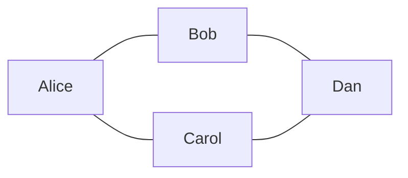
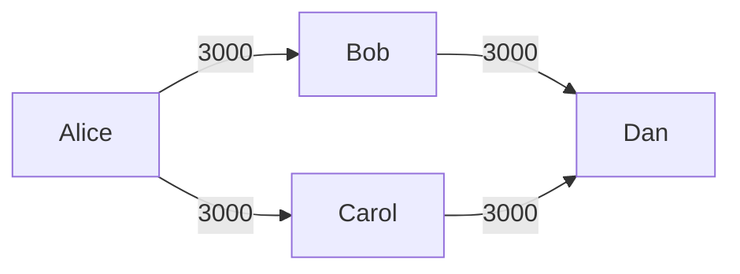
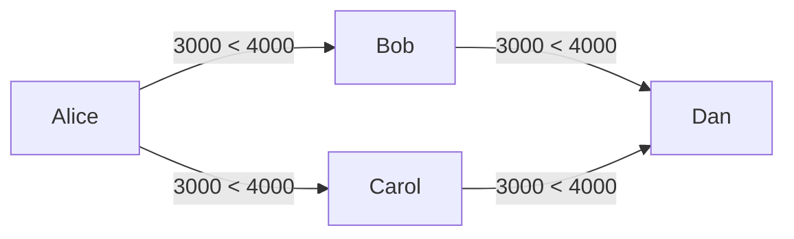
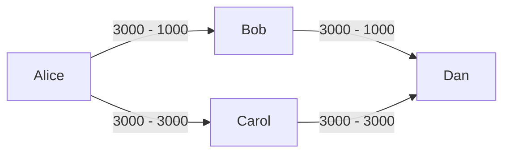
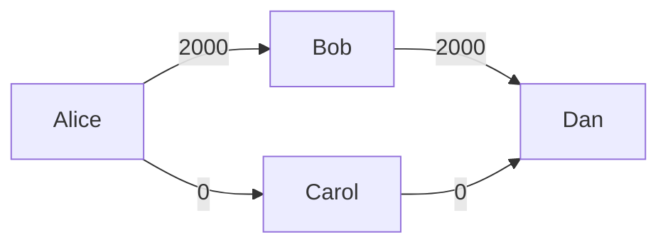

# Flow for invoices between four nodes with MPP and YUV

This test has four participants: Alice, Bob, Carol, and Dan, between which 
the lightning network will be initiated.

The network graph looks like this, where all the channels are with the same
chroma:



The final payment will be sent from **Alice** to **Dan**, with initial capacities:



To check that routing works correctly, we'll send payment in the amount 4000,
and as it is not enough for both channels separately:



The algorithm will split the payment into two values: 3000 and 1000:





## Preparations

Fund all users with bitcoins:

```shell
export WUSD=$(yuv-cli -c usd.dev.toml p2wpkh)
export WALICE=$(yuv-cli -c alice.dev.toml p2wpkh)
export WBOB=$(yuv-cli -c bob.dev.toml p2wpkh)
export WCAROL=$(yuv-cli -c carol.dev.toml p2wpkh)
export WDAN=$(yuv-cli -c dan.dev.toml p2wpkh)

# in yuv directory:
alias bitcoin-cli="docker compose --file ./infrastructure/dev/docker-compose.yaml --project-directory . exec bitcoind bitcoin-cli"

bitcoin-cli generatetoaddress 101 $WUSD
bitcoin-cli generatetoaddress 101 $WALICE
bitcoin-cli generatetoaddress 101 $WBOB
bitcoin-cli generatetoaddress 101 $WCAROL
bitcoin-cli generatetoaddress 101 $WDAN
```

Fund USD tokens to others:

```shell
export USD=$(yuv-cli -c usd.dev.toml p2tr)
export ALICE=$(yuv-cli -c alice.dev.toml p2tr)
export BOB=$(yuv-cli -c bob.dev.toml p2tr)
export CAROL=$(yuv-cli -c carol.dev.toml p2tr)
export DAN=$(yuv-cli -c dan.dev.toml p2tr)

yuv-cli -c usd.dev.toml issue\
   --recipient $ALICE --amount 10000\
   --recipient $ALICE --amount 10000\
   --recipient $BOB --amount 10000\
   --recipient $CAROL --amount 10000
```

## Start four nodes

> For determinitic behaviour of keys, the same seeds will be used from `test_data` dir.

Each command should be started in separate shell session (terminal window):

```sh
source ./scripts/start-node.sh alice
source ./scripts/start-node.sh bob
source ./scripts/start-node.sh carol
```

Connect peers for Alice and Dan:

```shell
connectpeer 03de26e88fbc9d13470eeb62fd0ffc436bee42ea8c1a00651ed31d2385becab912@127.0.0.1:8007
connectpeer 03a5a5ed3baef38531793ab1febc6ec015125c5245d09354ba962438ede0469918@127.0.0.1:8008
```

Connect peers for Bob, Carol:

```shell
connectpeer 03419cc4ce1b87e1b4f97ded6721f4a516fc29baaa39ac400a0f8a3eaaf418230c@127.0.0.1:8006
connectpeer 0269649f8d87d77041da5f6bb6921f322633fafd22a525201ef2a0de3a63530679@127.0.0.1:8009
```

Open channels with from Alice to Bob and Carol:

```shell
openchannel 03de26e88fbc9d13470eeb62fd0ffc436bee42ea8c1a00651ed31d2385becab912 100000 --pixel 3000:bcrt1p4v5dxtlzrrfuk57nxr3d6gwmtved47ulc55kcsk30h93e43ma2eqvrek30 --public

openchannel 03a5a5ed3baef38531793ab1febc6ec015125c5245d09354ba962438ede0469918 100000 --pixel 3000:bcrt1p4v5dxtlzrrfuk57nxr3d6gwmtved47ulc55kcsk30h93e43ma2eqvrek30 --public
```

Open channel from Bob to Dan, and from Carol to Dan:

```shell
openchannel 0269649f8d87d77041da5f6bb6921f322633fafd22a525201ef2a0de3a63530679 100000 --pixel 3000:bcrt1p4v5dxtlzrrfuk57nxr3d6gwmtved47ulc55kcsk30h93e43ma2eqvrek30 --public
```

Generate invoice from Dan:

```shell
getinvoice 7000000 36000 --pixel 4000:bcrt1p4v5dxtlzrrfuk57nxr3d6gwmtved47ulc55kcsk30h93e43ma2eqvrek30
```

And send it from Alice:

```shell
sendpayment <past-invoice-here>
```

